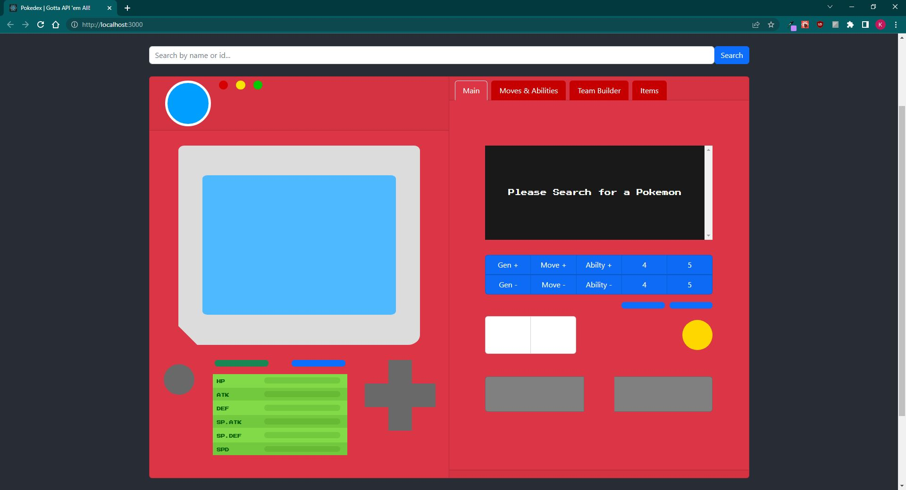
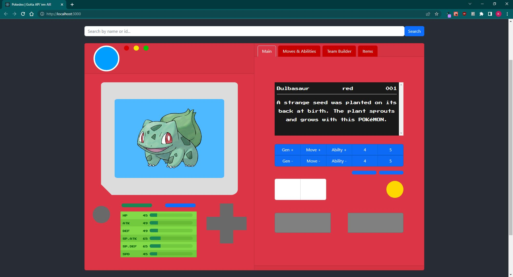
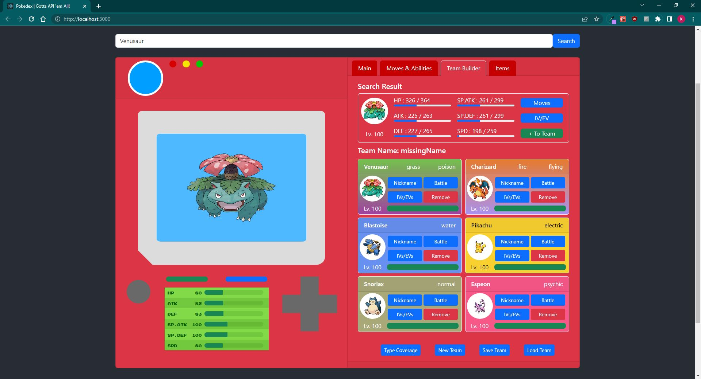

# Pokedex App

**Author**: Kawika Miller

**Version**: 1.3

[**Deployed Site**](https://kmdevsign-pokedex.netlify.app/)

[**Deployed Site (Backup)**](https://pokedex-frontend.onrender.com/)

[**Server Repo**](https://github.com/KMArtwork/pokedex-backend)

## Overview
This application will allow a user to query the PokeAPI and view the results in a kanto-pokedex-styled UI.

*There are weird scaling/sizing issues with the React-Bootstrap components that still need to be addressed. Therefore, this app works/looks best if your web browser window is at full size*

- When you first load the app you will be greeted with this screen. Go ahead and search for a pokemon and the result should load!
  - *Because of how the PokeAPI works, there are a few Pokemon that need to be searched with a hyphenated query. (e.g. Searching for "Giratina" will not return any search results, but searching for "Giratina-origin" will work. I am in the early stages of working on a fix for this but until then you can search for these edge cases using a hyphenated search OR using their pokedex number*)

- After you've made your search you will see something similar to the screenshot above. 

- Some of these buttons aren't just for show!
  - Click on the grey circle button on the left to hear the pokemon's cry
  - The green button will toggle between the different forms a pokemon has if applicable (e.g. seasonal / regional / etc.)
    - There are a few edge cases where the PokeAPI is inconsistent with how they handle this information so you may run into some strange bugs depending on which pokemon you search. (search for 'Unown' for an example!)
    - I know it's actually supposed to be red but that makes it hard to see in its current state
  - The blue button will toggle between the shiny version of that pokemon and the normal version
  - The D-pad's left and right buttons will go back and forward by 1 pokedex number respectively.
  - The D-pad's up and down buttons will go forward and back by 1 generation. (e.g. if you're on Pikachu and you click up, it will take you to the Chikorita - the start of Gen 2. If you're on Pichu and you click down it will take you to Bulbasaur)
  - The `gen+` and `gen-` buttons cycle through each generation's pokedex entry for a given pokemon.
  - The `move+` and `move-` buttons cycle through each of the Pokemon's moves and gives a brief description of what the move does
  - The `ability+` and `ability-` buttons cycle through each of the Pokemon's abilities and gives a brief description of what the ability does.

If you click the `Moves and Abilities` tab on the right, you can view a more detailed breakdown of each of the Pokemon's moves and abilities.

If you click on the `Team Builder` tab on the right, you can create your own Pokemon team.

- The `Search Result` section allows you to modify the pokemon's IVs and EVs, their four moves you will use for battle, as well as their ability and held item before committing them to your team.

- You can always edit these values after they've been added to your team as well or remove them from the team completely.

- You can view your current team's defenseive type coverage with the `Type Coverage` button at the bottom

- The `New Team` button will clear your entire team

- The `Save Team` and `Load Team` button do work but the back end repo hasn't been pushed up to GitHub yet so they won't actually do anything if you run this locally.
  - Currently, they save everything to a database being hosted on MongoDB Atlas
  - There's also no separation of pokemon teams based on login credentials so all saved teams get thrown into one singular DB - I need to reconfigure this and set the backend up properly so that people can use Auth0 to login with their google accounts and only be able to access their own saved teams.
  - Also thinking of setting this up to use a PostgreSQL database instead of MongoDB

The `Items` tab is still being worked on.

## Architecture
- React
- React-Bootstrap
- Redux
- Redux Toolkit

## Change Log

### 2023-07-04 - 2023-07-17:
- Implement Sass stylesheets
- Removed all non-essential inline styles, add them to sass stylesheets
- Implement four custom theme options across app & its components
  - Pokeball
  - Greatball
  - Ultraball
  - Masterball
- Handle bad search queries
  - A 'Toast' component will now pop up if you make a bad search
- Create a 'User Dropdown' menu when logged in
  - Much more modern ui/ux
- Add search bar autocomplete
  - Still needs a bit of polishing
  - Sometimes the auto-complete dropdown will not appear. If this happens, just click outside of the search bar and then click back into it.
- Add visual confirmation / cue to buttons that filter moves by generation
- Able to filter moves by all generations & the titles in each generation
  - e.g. Can now view moves from each main game title (yellow, diamond, firered, colosseum, arceus, etc) instead of just by generation (gen1, gen2, gen3, etc)
- Atomized various 'details' components
- Add 'About' and 'Contact' page
  - About page still needs to be furthered updated
  - Want to add a 'how to' section with visual aid/diagram on what each button does, what each tab does, etc.

### 2023-06-29 - 2023-07-03:
- Add content to 'items' tab
- Add 'Items Categories' component
  - Displays a list of all the `pockets` of a player's 'Bag'
  - Each `pocket` has various 'categories' which represent the different types of items that a pocket holds
  - Each category is represented by a checkbox which the user can toggle
  - When the `Apply` button is clicked, all items from the checked checkboxes will be fetched and displayed
- Add placeholder components (e.g. 'Spinner' and 'Placeholder') so that the user has a visual representation of when the requests are being made and the responses are being awaited
- Refactor API calls to be proxy requests
  - i.e. The client no longer makes a request directly to PokeAPI, instead the client will make a request to the server and the server will make a request to PokeAPI and then respond with the data

### 2023-06-20 - 2023-06-28:
  - API Calls
    - Refactor api call for faster response when fetching supplemental move data
    - Refactor dpad functionality
      - Cleaner code
  - Login / Signup
    - Move login / signup feature to a modal instead of being in the header
  - Layout
    - Update 'Save Team' form
      - Able to add / change team name
      - Able to save a new team or overwrite existing team
    - Update layout of 'Main' tab
      - Consolidate all pokemon information into one place instead of having it spread out
    - Add ability to view all moves by generation & their learn methods
  - Style
    - Update the styling of the moves and abilities components
    - Create Badge components for pokemon types
    - Begin modularizing stylesheets

### 2023-05-30 - 2023-06-19:
  - Added user login / logout / signup functionality
  - Add reauthentication on reload via cookies
  - User will now be able to save their own teams and have them protected via login credentials (e.g. Users are only able to load/save/delete their own teams)
  - App is deployed on netlify & render

### 2023-03-23 - 2023-05-30:
- Updated styling
- Team Member background colors conditional on type(s)
- Added button for Pokemon cry
- Added DPAD that allows user to move up/down by generation or left/right by pokemon number +/-
- Added 'Main' tab that mimics original Kanto pokedex layout
  - Use buttons to display every generation of pokedex entries
  - Toggle through moves and abilities
- Implemented solution for various search query edge cases (e.g. 'wormadam-plant', 'giratina-altered', etc.)
- Source missing sprites
- Added ability to toggle between shiny and normal pokemon sprite
- Added ability to toggle between various forms of a pokemon (e.g. seasonal, regional, mega, etc.)
- Consolidated all edit pokemon forms into one form (i.e. Edit IV/EV, edit moves, edit nickname are now all in one form)
- Refactored majority of components from React Class to React Functional components
- Implemented Redux & Redux Toolkit to handle state
  - All components now rely on Redux store to handle state - no more prop drilling!
  - All server calls & data fetching are handled with reducers / useDispatch
  - Refactor API calls to PokeAPI to be more modular
    - From one giant function to multiple smaller ones chained together with `.then`s

### 2023-03-22
- Able to delete a team from the database

### 2023-03-21
- Able to load teams from database and render to screen
- Minor reworks to shape of the `team` object sent to database. `pokemon` is now a property of `team` whose value is an array of pokemon objects instead of the six individual properties (e.g. `slot1`, `slot2`, etc.)
  - This makes it easier for rendering the team back to the screen after the GET request (e.g. 'Load Team') has been made.

### 2023-03-05 - 2023-03-19 
- Add team builder
- Can add/remove a Pokemon to/from team of 6
- Can edit EVs/IVs, Level, and Nature
- Can select 4 Battle Moves, Ability, and Held Item
  - Held item functionality is there, but list of items does not exist
- Can save team to database
  - Server is not currently deployed, must be ran locally
- Can see type coverage chart

### 2023-03-04
- Modularize move-lists and move-container.

### 2023-03-02
- Add ability information to screen

### 2023-03-01
- Moves refresh/rerender when a new pokemon is searched for

### 2023-02-24
- Add search bar and show results

### 2023-02-23
- Initialize project

## Credit and Collaborations